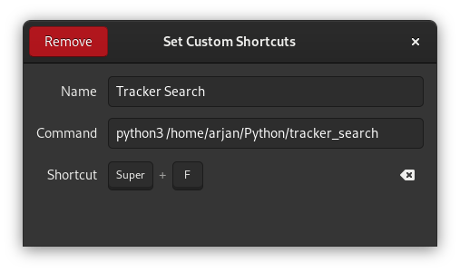

# Tracker Search

[Tracker Search](https://github.com/wooni005/tracker_search) is a full text search Qt application. The [Gnome Tracker](https://wiki.gnome.org/Projects/Tracker) is a filesystem indexer which currently shipped with [Gnome 3](https://www.gnome.org/gnome-3/). The Gnome Tracker is used by Nautilus, but none of the Gnome tools is able to perform a full text search in the index. But that is exactly what [Tracker Search](https://github.com/wooni005/tracker_search) does

 

## Installation

```bash
$ cd
$ mkdir Python
$ cd Python
$ git clone https://github.com/wooni005/tracker_search.git
```

**Set a custom shortcut in Gnome**

Start Settings and select "Keyboard Shortcuts", click on the "+" button at the bottom and fill in the following settings to start Tracker Search with the Super-F key.
Replace "/home/arjan" with your own user path.



## Configuration

The `settings.conf` file is located in `~/.config/tracker_search` and will be generated when the application starts for the first time.

These are the default setting. The `[General]` section contains the latest position and size of the window. This will be automatically updated.

The `[documentTypes]` section contains all extensions for filtering the results.
The `[searchAreas]` section contains all paths for filtering the results

Keep in mind that if you remove or add something to these sections, you need to adapt the size also.

```ini
[General]
pos=@Point(0 0)
size=@Size(1920 1043)

[documentTypes]
1\name=Markdown
1\type=md
2\name=PDF
2\type=pdf
3\name=MP3
3\type=mp3
4\name=Doc
4\type=docs
5\name=TXT
5\type=txt
size=5

[searchAreas]
1\name=Notities
1\path=/home/arjan/Documenten/Gitea/Notities/Notities
2\name=Computerboeken
2\path=/home/arjan/Nas/Boeken/Computer
3\name=Tijdschriften
3\path=/home/arjan/Nas/Tijdschriften
size=3
```

# Tracker internals

It is possible to change detailed settings of Tracker with the **dconf-editor** in **/org/freedesktop/tracker/miner/files**:

* **crawling-interval** -> **0** force to activate the crawler right now. But after crawling it needs to set back to the default -1

* Possible to change the directories, which needs to be indexed: **index-recursive-directories**, for example: 
  ['&DESKTOP', '/home/arjan/Documenten/Gitea/Notities/Notities/', '&MUSIC', '&PICTURES', '&VIDEOS', '/home/arjan/Nas/Tijdschriften']

* In **Nautilus->Preferences->Search & Preview**->**Search**: **Alle locations**

Status of the tracker can be seen with:

```bash
$ tracker daemon
Store:
29 Jul 2020, 22:33:04:  ✗     Store                   - Unavailable

Miners:
29 Jul 2020, 22:33:04:  ✗     RSS/ATOM Feeds          - Not running or is a disabled plugin
29 Jul 2020, 22:33:04:  ✓     File System             - Idle 
29 Jul 2020, 22:33:04:  ✗     Extractor               - Not running or is a disabled plugin
```

Also possible to reindex all data with a hard reset of the index:

```bash
$ tracker reset --hard
g_io_module_get_default: Found default implementation dconf (DConfSettingsBackend) for ‘gsettings-backend’
Setting database locations
Checking database directories exist
Checking database version
Checking whether database files exist
Removing all database/storage files
  Removing database:'/home/arjan/.cache/tracker/meta.db'
  Removing db-locale file:'/home/arjan/.cache/tracker/db-locale.txt'
  Removing journal:'/home/arjan/.local/share/tracker/data/tracker-store.journal'
  Removing db-version file:'/home/arjan/.cache/tracker/db-version.txt'
```

Start the tracker daemon with:

```bash
$ tracker daemon -s
```

Test how to search the index:

```bash
tracker search -fs linux
```

Tracker-fs indexer manual restart:

```bash
# Stop the tracker daemon
$ tracker daemon -t
# Start the indexer with debug info
/usr/libexec/tracker-miner-fs -v 3
```

Info: [Projects/Tracker/Documentation/Debugging - GNOME Wiki!](https://wiki.gnome.org/Projects/Tracker/Documentation/Debugging)